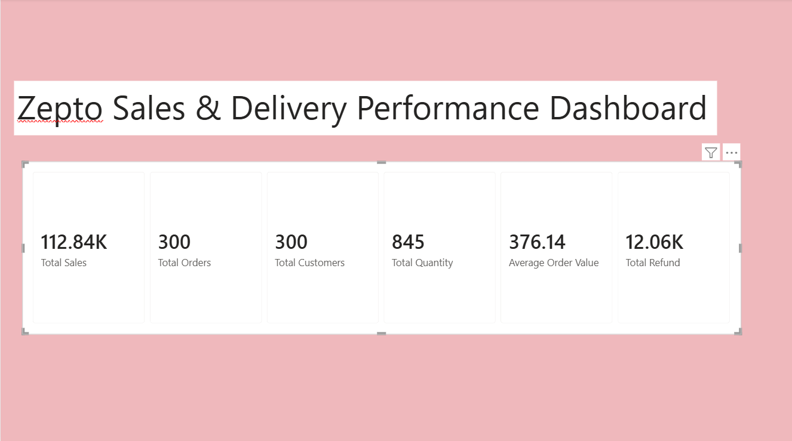

# 🛒 Zepto Sales & Delivery Performance Dashboard

## 📌 Project Overview

This project is an interactive **Power BI dashboard** built using a Zepto sales dataset. The dashboard provides insights into sales performance, customer behavior, warehouse performance, delivery status, refund trends, and payment methods through interactive visualizations and filters.

The objective of this dashboard is to help business users monitor key performance indicators (KPIs), analyze sales trends, and make data-driven decisions.

---

## 📊 Dashboard Features

### 🔹 KPI Overview
- Total Sales
- Total Orders
- Total Customers
- Total Quantity Sold
- Average Order Value
- Total Refund

### 🔹 Sales Analysis
- Sales by Customer Segment
- Sales by City
- Sales by Product Category
- Monthly Sales Trend
- Orders by Payment Method

### 🔹 Delivery & Warehouse Analysis
- Sales by Warehouse
- Delivery Status Distribution
- Refund Analysis by City

### 🔹 Interactive Filters
Users can filter the dashboard using:
- Order Date
- City
- Product Category
- Customer Segment
- Warehouse
- Payment Method

---

## 🛠️ Tools & Technologies

- Power BI Desktop
- DAX (Data Analysis Expressions)
- Power Query
- Microsoft Excel
- Data Modeling
- Data Visualization

---

## 📂 Dataset

**Dataset:** Sample Zepto Sales Dataset (Excel)

The dataset contains information related to:
- Customer Details
- Orders
- Products
- Warehouses
- Payment Methods
- Delivery Status
- Refunds

---

## 📸 Dashboard Preview

### 📈 KPI Overview

---

### 📊 Sales Analysis

---

### 🚚 Delivery & Warehouse Analysis

---

## 💡 Key Insights

- Analyzed overall sales performance using interactive KPIs.
- Compared sales across multiple cities and warehouses.
- Identified customer segments contributing to higher sales.
- Evaluated payment method preferences.
- Monitored delivery success, cancellations, returns, and refunds.
- Enabled dynamic filtering for detailed business analysis.

---

## 🎯 Business Value

This dashboard helps businesses to:

- Monitor overall sales performance.
- Track customer purchasing behavior.
- Analyze warehouse performance.
- Identify refund patterns.
- Improve delivery efficiency.
- Support data-driven business decisions.

---

## 👨‍💻 Author

**K. Chanikya**

GitHub: https://github.com/kchanikya16
